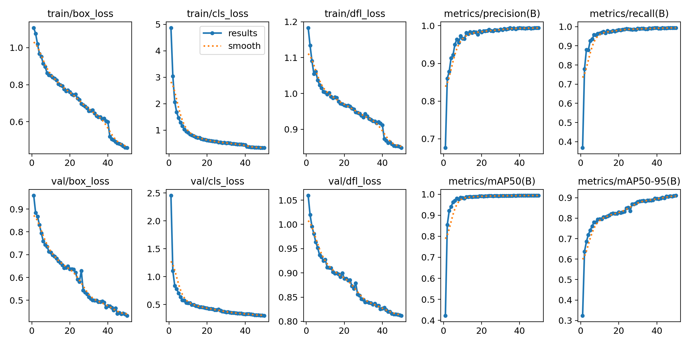
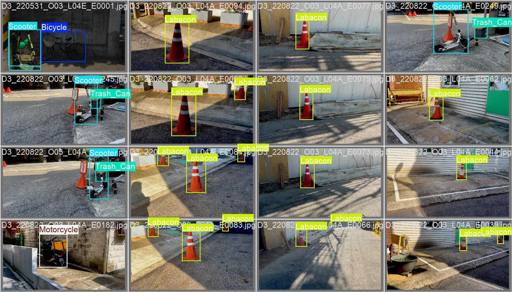
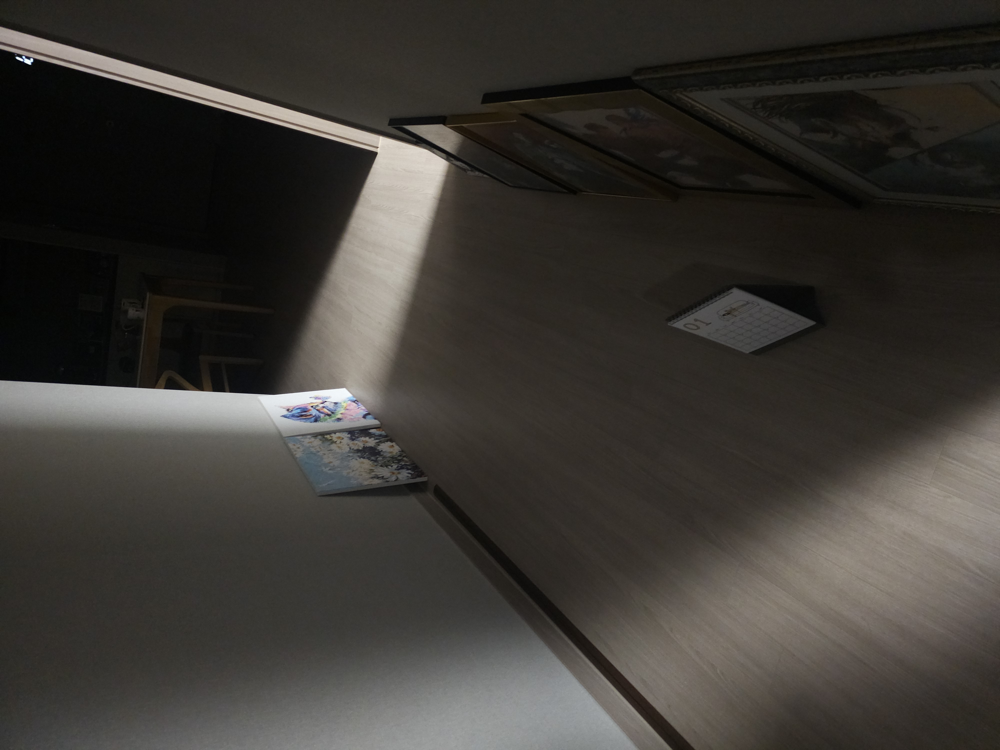
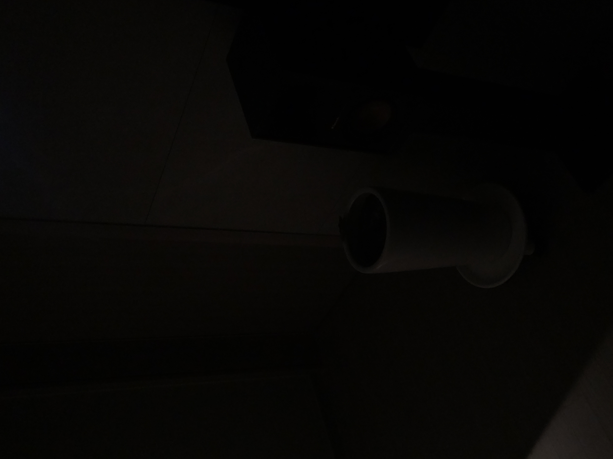
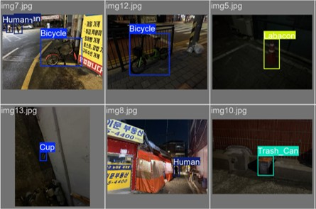

# Capstone II
Brightness-Stage Adaptive Augmentation for Robust Low-Light Object Detection

## 1. Overview
Conventional low-light enhancement research (e.g., Retinex-based deep models, GAN-based relighting) focuses on restoring visually pleasing images using complex restoration networks.

However:
- These methods optimize perceptual image quality rather than detection performance.
- They require an additional enhancement network, increasing inference latency and system complexity.
- Improvement in image quality does not guarantee improved object detection mAP.

Instead of restoring images, this study proposes a **data-centric brightness-stage adaptive augmentation framework**, allowing a YOLO-based detector to directly learn illumination variations without introducing extra networks.

The goal is to improve mAP under low-light conditions without architectural modification.

## 2. Dataset Construction
### Source
AI-Hub Low-light Object Detection Dataset. Due to its large scale, only the following brightness stages were selected:
  - Stage 1: 24,888 images
  - Stage 3: 24,895 images
  - Stage 5: 24,867 images
These stages represent progressively varying illumination severity and were selected to model realistic low-light transitions.
### Dataset Statistics
- Total JSON annotations scanned: 74,650
- Final usable images: ~73,634
- Final classes after rare-class filtering: ~28

## 3. Class Balancing Strategy
- Scanned 74,650 labeled JSON annotations
- Scene grouping performed based on filename continuity (±30 frames), resulting in ~2,300 scene groups
- Removed classes with ≤300 instances
- Removed near-duplicate frames
- Selected 250 images per class
- Train / Val / Test split = 70 / 15 / 15

## 4. Brightness Stage Classification Model
To avoid relying on filename metadata ("A/C/E"), we trained a content-based brightness classifier.
 - Backbone: ResNet18
 - Classes: Stage1 / Stage3 / Stage5
 - Loss: CrossEntropy
 - Optimizer: Adam
 - Epochs: 10
This allows illumination-aware augmentation directly from image content.

## 5. Augmentation Strategy
 ### Basic Augmentation
 - Horizontal Flip
 - ±10° Rotation
 - Brightness & Contrast shift
 - Color jitter
 - YOLO-format bbox transformation
 - Bboxes clipped if out-of-bound
 - Only boxes ≥20% visible retained

### Brightness-Stage Adaptive Gamma Augmentation
Stage 1:
   - Gamma = 1.05, 1.12
   - Enhance random.uniform(1.00–1.08)
Stage 3:
   - Gamma = 0.98, 1.02
   - Enhance random.uniform(0.95–1.05)
Stage 5:
   - Gamma = 0.92, 0.98
   - Enhance random.uniform(0.92–1.02)

Gamma ranges were redesigned per brightness stage to simulate realistic illumination variation while preserving scene consistency.

## 6. Model Training
- Detector: YOLOv11n
- Epochs: 50
- Batch size: 16
- Image size: 640×640
Two models were trained:
1. Basic augmentation only
2. Brightness-stage adaptive augmentation

## 7. Experimental Results
| Metric       | Basic Aug | Stage-Adaptive Aug | Δ (%)    |
|--------------|-----------|-------------------|----------|
| Precision    | 0.9310    | **0.9625**        | +3.15%   |
| Recall       | 0.8648    | **0.9652**        | +10.04%  |
| mAP50        | 0.8788    | **0.9854**        | +10.66%  |
| mAP50-95     | 0.8140    | **0.8303**        | +1.63%   |

### Training Curve

### Sample Detection

### Key Findings
- Significant improvement in mAP50 (+10.6%)
- Recall dramatically increased (+10%)
- High-confidence predictions reached ~0.99 precision
- Stable detection under unseen low-light generalization set (152 images)
  
Performance gain is attributed to:

  - Rare-class filtering
  - Balanced sampling
  - Stage-specific gamma redesign

The most notable improvement was observed in recall and mAP50, indicating enhanced robustness under severe illumination conditions.

## 8. Generalization Test
A separate set of 152 indoor/outdoor low-light images was collected.

### Sample Raw Images

###  Sample Detection Results

The model successfully detected objects under diverse illumination conditions, confirming robustness beyond training distribution.

## 9. Conclusion
Brightness-stage adaptive augmentation demonstrates:

- Improved detection robustness without additional inference complexity
- Superior performance over baseline augmentation
- A lightweight data-centric alternative to restoration-based pipelines

This demonstrates that illumination modeling at the data level is highly effective for low-light object detection.

## 10. Repository Structure

- [data_processing/](./src/data_processing/) : Scene grouping & balancing scripts
  - `scene_split.py` : Group images/labels by scene and perform balancing

- [brightness_classifier/](./src/brightness_classifier/) : ResNet18 brightness prediction model
  - `stage_split.py` : Create train/val/test structure based on filename and classify brightness stage
  - `augmen_class.py` : Train ResNet18 model for brightness stage classification

- [augmentation/](./src/augmentation/) : Stage-aware augmentation pipeline
  - `basic_yolo_augment.py` : YOLO bounding box basic augmentation
  - `brightness_stage_aug.py` : Integrated pipeline for YOLO bbox + stage-based brightness augmentation

- yolo_training: YOLOv11 training & configuration scripts (handled by teammate, code not included)

## 11. References
Review of references related to low-light environment imaging:
  - [Deep Retinex Decomposition for Low-Light Enhancement (2018)](https://github.com/lyeonw18/Paper-Reviews/blob/main/Low-Light-Image-Enhancement/review1.md)
  - [EnlightenGAN: Deep Light Enhancement without Paired Supervision (2019)](https://github.com/lyeonw18/Paper-Reviews/blob/main/Low-Light-Image-Enhancement/review2.md)
  - [Zero-Reference Deep Curve Estimation (2020)](https://github.com/lyeonw18/Paper-Reviews/blob/main/Low-Light-Image-Enhancement/review3.md)

